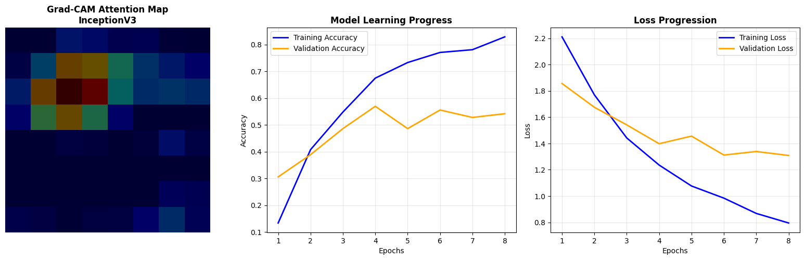

# 💃 Indian Classical Dance Classification & Explainability (XAI)

## 📌 Project Overview
This repository contains a deep learning framework designed to classify **8 forms of Indian Classical Dance**. While many models act as "black boxes," this project implements **Grad-CAM** to provide visual explanations. This ensures the model identifies dance forms based on authentic cultural markers like hand gestures (**Mudras**) and leg postures—rather than background artifacts.

---

## 🚀 The Development Story: Benchmarking to Production

### **Phase 1: Architecture Benchmarking**
I compared three architectures over a 3-epoch trial to evaluate feature extraction efficiency. **InceptionV3** emerged as the optimal choice due to its inception modules that capture features at multiple scales.
* **Simple CNN:** Baseline performance; lacked spatial localization.
* **VGG16:** Robust but showed slower convergence.
* **InceptionV3:** Precise "attention" heatmaps and highest initial accuracy.

### **Phase 2: Production & Optimization**
The winning model was trained for 25 epochs with:
* **Early Stopping:** Monitored `val_loss` to restore weights from the optimal epoch (Epoch 20).
* **Transfer Learning:** Leveraged ImageNet weights to compensate for the niche dataset size.

---

## 📊 Performance & Overfitting Analysis
| Metric | Result |
| :--- | :--- |
| **Best Model** | InceptionV3 |
| **Training Accuracy** | **99.42%** |
| **Validation Accuracy** | **61.11% - 66.67%** |

### **🔍 Critical Discussion: Addressing Overfitting**
The gap between 99% training accuracy and 66% validation accuracy indicates **High Variance (Overfitting)**. This is a common phenomenon in specialized cultural datasets where high-capacity models (like Inception) can easily "memorize" a small number of samples.

**Mitigation Strategies:**
1. **Restoration:** Used `restore_best_weights` to ignore the final (overfitted) epochs.
2. **XAI Verification:** Despite the gap, **Grad-CAM** confirmed the model still prioritizes the dancer's silhouette and limbs, proving that the model learned generalized dance postures even while overfitting to specific backgrounds.

---

## 🧠 Explainability (XAI) with Grad-CAM
Using Grad-CAM, we overlay "attention heatmaps" to verify the model's logic. Our InceptionV3 model successfully localized its focus on the dancer's posture and hand positions.

*Figure 1: Comparison showing the original dancer and the corresponding heatmaps generated by the model.*

---

## 📂 Repository Structure
* `Indian_Dance_XAI.ipynb`: Full end-to-end pipeline.
* `best_dance_model.keras`: Optimized InceptionV3 weights.
* `final_dance_analysis.png`: Plot of XAI heatmaps and learning curves.
* `leaderboard.csv`: (Generated) Comparison data of tested architectures.

---

## 📚 References & Citations
* **InceptionV3:** Szegedy, C., et al. (2016). "Rethinking the Inception Architecture for Computer Vision." [arXiv:1512.00567](https://arxiv.org/abs/1512.00567).
* **Grad-CAM:** Selvaraju, R. R., et al. (2017). "Grad-CAM: Visual Explanations from Deep Networks via Gradient-based Localization." [arXiv:1610.02391](https://arxiv.org/abs/1610.02391).
* **Transfer Learning:** Pan, S. J., & Yang, Q. (2010). "A Survey on Transfer Learning." IEEE Transactions on Knowledge and Data Engineering.
* **Dataset:** Somnath, ["Indian Dance Form Recognition," Kaggle Hub.](https://www.kaggle.com/datasets/somnath796/indian-dance-form-recognition?resource=download)

---

## 📝 Conclusion
By combining **Transfer Learning** with **Explainable AI**, this project proves that deep learning can be trained to respect technical nuances in classical arts while providing transparent reasoning for its classifications.
